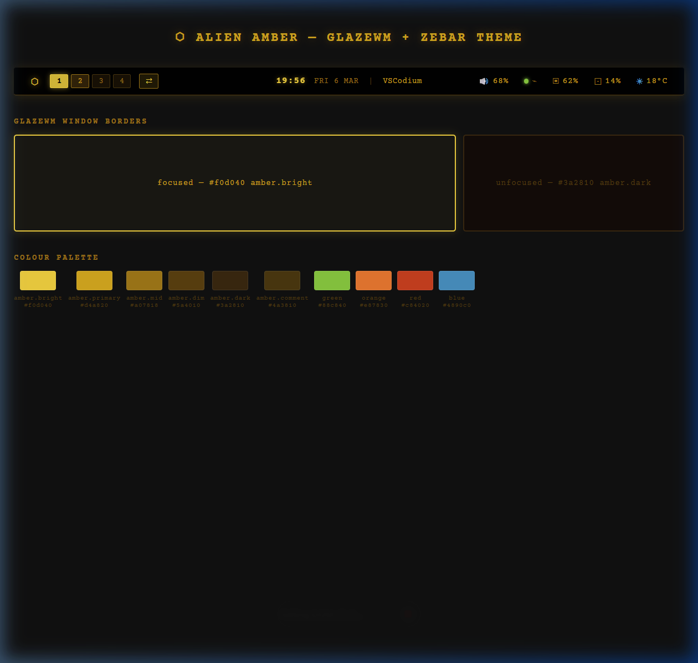

# Alien Amber — GlazeWM + Zebar Theme

> Retro CRT phosphor terminal aesthetic for Windows, inspired by the [Alien Amber VS Codium theme](https://github.com/daviddelven/alien-amber-theme).



---

## Color Palette

| Token | Hex | Role |
|---|---|---|
| `amber.bright` | `#f0d040` | Focused border, time, logo glow |
| `amber.primary` | `#d4a820` | Default text, system info |
| `amber.mid` | `#a07818` | Icons, secondary text |
| `amber.dim` | `#5a4010` | Workspace bg, separators |
| `amber.dark` | `#3a2810` | Unfocused window border |
| `amber.comment` | `#4a3810` | Workspace pill border |
| `green` | `#88c840` | Battery charging, good network |
| `orange` | `#e87830` | Binding mode pill, fair network |
| `red` | `#c84020` | CPU high-usage warning |
| `blue` | `#4890c0` | Weather icons |

---

## Features

### GlazeWM
- **Focused window border** → `#f0d040` amber.bright with phosphor glow effect
- **Unfocused window border** → `#3a2810` amber.dark (subtle, no visual noise)

### Zebar bar
- **Left:** Terminal logo · Workspace pills (clickable) · Tiling direction toggle
- **Center:** `HH:mm` (prominent) · `EEE d MMM` (secondary) · `| App name`
- **Right:** Volume (with muted state) · Network semaphore dot · RAM · CPU · Battery · Weather

#### Network semaphore
| Signal | Indicator |
|---|---|
| Ethernet / WiFi ≥ 65% | 🟢 Green |
| WiFi 35–64% | 🟠 Orange |
| WiFi < 35% | 🔴 Red |
| No connection | ⚫ Dim |

#### Volume
- Shows current volume percentage with icon  
- Dims to `amber.dim` when muted

---

## Automation (Recommended)

If you have access to the DDV infrastructure automation scripts, run:

`powershell
& 'G:\My Drive\DDV_PARA\2. AREAS\DIGITAL SYSTEMS\AI\infrastructure\automation\glazewm-theme-sync\sync-theme.ps1'
``n
## Installation

### Prerequisites
- [GlazeWM](https://github.com/glzr-io/glazewm)
- [Zebar](https://github.com/glzr-io/zebar)
- [Courier Prime](https://fonts.google.com/specimen/Courier+Prime) font
- A [Nerd Font](https://www.nerdfonts.com/) (for bar icons)

### 1. GlazeWM

Edit `~/.glzr/glazewm/config.yaml` and replace the `window_effects` section:

```yaml
window_effects:
  focused_window:
    border:
      enabled: true
      color: "#f0d040"   # amber.bright
  other_windows:
    border:
      enabled: true
      color: "#3a2810"   # amber.dark
```

Or copy the full `glazewm/config.yaml` from this repo (keeps all original keybindings from [vimichael/make-windows-pretty](https://github.com/vimichael/make-windows-pretty)).

### 2. Zebar

Copy the widget folder to your Zebar directory:

```powershell
cp ./zebar/alien-amber/ "$env:USERPROFILE\.glzr\zebar\" -Recurse
```

Then enable it in the Zebar system tray, or set it as the default widget.

### 3. Reload

```
Alt+Shift+R   → Reload GlazeWM config
```

Zebar picks up CSS/HTML changes automatically on save.

---

## File Structure

```
.
├── glazewm/
│   └── config.yaml          # Full GlazeWM config with Alien Amber borders
├── zebar/
│   └── alien-amber/
│       ├── alien-amber.html  # Bar widget (React/JSX, buildless)
│       ├── styles.css        # Alien Amber styles
│       └── zpack.json        # Zebar widget manifest
├── preview/
│   └── preview.png           # Theme preview
└── README.md
```

---

## Credits

- Color palette: [Alien Amber VS Codium Theme](https://github.com/daviddelven/alien-amber-theme) by [@daviddelven](https://github.com/daviddelven)
- Base widget structure: [vimichael/make-windows-pretty](https://github.com/vimichael/make-windows-pretty) `alien-amber` (formerly `vanilla-clear`)

## License

MIT
